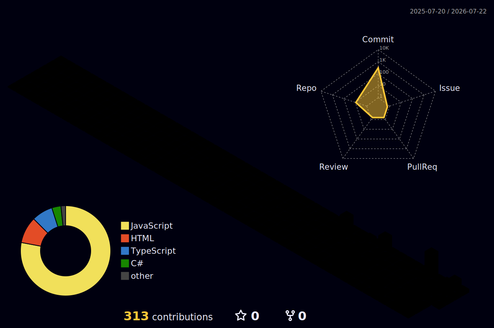

<!-- ═══════════════════════ ANIMATED WAVE HEADER ═══════════════════════ -->
<div align="center">
  
</div>

<!-- ═══════════════════════ TYPING ANIMATION ═══════════════════════ -->
<div align="center">
  <a href="https://github.com/Lokii1211">
    
  </a>
</div>

<!-- ═══════════════════════ SOCIAL BADGES ═══════════════════════ -->
<div align="center">
  <a href="https://lokii1211.github.io"></a>
  <a href="https://linkedin.com/in/lokiiii1211"></a>
  <a href="mailto:lokiiii1211@gmail.com"></a>
  <a href="https://wa.me/919003360494"></a>
  <br/>
  
  
</div>

<br/>

<!-- ═══════════════════════ ABOUT ═══════════════════════ -->


## 🧬 About Me

```python
class LokeshkumarD(AIEngineer):
    def __init__(self):
        self.location   = "Coimbatore, India 🇮🇳"
        self.role       = "AI Engineer | Agentic AI Architect"
        self.education  = "B.Tech IT @ Sri Krishna College of Technology"
        self.live_products = ["Viya AI", "Kaizy", "Mentixy", "KadaiGPT"]
        self.languages  = ["Tamil", "English", "+3 Indian languages via NLP"]

    def current_focus(self):
        return ["Multi-Agent Systems", "RAG Pipelines",
                "LLM Orchestration", "Voice AI"]

    def hire_me(self):
        return "lokiiii1211@gmail.com"  # responds in < 24h ⚡
```

- 🏆 **VEL IDEAFORGE 2K26 Finalist** · **UIDAI National Hackathon** (led analysis of **4.94M+ Aadhaar records**)
- 🚀 **4 production AI products** serving real users **24/7** with **99.5% uptime**
- 📦 **310+ production commits** across live systems
- 🌏 Open to **Remote / Relocation** — AI Engineering roles & freelance projects

<br clear="right"/>


<!-- ═══════════════════════ LIVE PRODUCTS ═══════════════════════ -->
## 🚀 Live Products — Used Daily by Real People

<table>
  <tr>
    <td width="50%">
      <h3 align="center">💰 Viya AI — Life & Wealth Partner</h3>
      <div align="center">
        <a href="https://heyviya.vercel.app"></a>
        <p><strong>Conversational AI for expenses, budgets, habits & goals — in 5 Indian languages (95%+ intent accuracy)</strong></p>
        <p>4-stage LangChain agentic workflow · n8n orchestration · ChromaDB RAG · WhatsApp bot · Whisper STT · sub-2s latency</p>
        
        
        
        
        
        <br/><a href="https://github.com/Lokii1211/MoneyViya">📂 Repository</a>
      </div>
    </td>
    <td width="50%">
      <h3 align="center">👷 Kaizy — India's Workforce OS</h3>
      <div align="center">
        <a href="https://kaizyy.vercel.app"></a>
        <p><strong>Workforce marketplace: verified workers across 35 categories with same-day UPI payouts</strong></p>
        <p>3-round geo-dispatch engine · dynamic pricing (8 multipliers) · Razorpay escrow · real-time tracking · SOS system</p>
        
        
        
        
        
        <br/><a href="https://github.com/Lokii1211/kaizy">📂 Repository</a>
      </div>
    </td>
  </tr>
  <tr>
    <td width="50%">
      <h3 align="center">🎯 Mentixy — AI Career Intelligence</h3>
      <div align="center">
        <a href="https://synaptiqq.vercel.app"></a>
        <p><strong>15+ features: AI counselor, coding arena (Judge0), aptitude engine, 4D career profiling, Campus Wars</strong></p>
        <p>CareerDNA™ vector profiling · pgvector 256-dim embeddings · LLM recommendations · skill-gap analysis</p>
        
        
        
        
        
        <br/><a href="https://github.com/Lokii1211/SynaptiQ">📂 Repository</a>
      </div>
    </td>
    <td width="50%">
      <h3 align="center">🛒 KadaiGPT — AI Smart Shop Assistant</h3>
      <div align="center">
        <a href="https://github.com/Lokii1211/kadaigpt"></a>
        <p><strong>Multi-agent AI (Billing · Inventory · Analytics · WhatsApp) for 12M+ Indian kirana stores</strong></p>
        <p>Bilingual voice commerce (Tamil/English) · automated GST invoicing · offline-first PWA · OCR scanning · 190+ commits</p>
        
        
        
        
        
        <br/><a href="https://github.com/Lokii1211/kadaigpt">📂 Repository</a>
      </div>
    </td>
  </tr>
</table>


<!-- ═══════════════════════ TECH STACK ═══════════════════════ -->
## ⚡ Tech Arsenal

<div align="center">

### 🧠 AI / LLM / Agentic

<br/>


### 💻 Full-Stack


### 🗄️ Data & DevOps

<br/>


</div>


<!-- ═══════════════════════ 3D CONTRIBUTION GRAPH ═══════════════════════ -->
## 🏙️ 3D Contribution City

<div align="center">
  
</div>

<!-- ═══════════════════════ SNAKE ANIMATION ═══════════════════════ -->
## 🐍 Contribution Snake

<div align="center">
  <picture>
    <source media="(prefers-color-scheme: dark)" srcset="https://raw.githubusercontent.com/Lokii1211/Lokii1211/output/github-contribution-grid-snake-dark.svg"/>
    <source media="(prefers-color-scheme: light)" srcset="https://raw.githubusercontent.com/Lokii1211/Lokii1211/output/github-contribution-grid-snake.svg"/>
    
  </picture>
</div>


<!-- ═══════════════════════ GITHUB ANALYTICS ═══════════════════════ -->
## 📊 GitHub Analytics

<div align="center">
  
  
</div>

<div align="center">
  
</div>

<div align="center">
  
</div>

<div align="center">
  
</div>


<!-- ═══════════════════════ ACHIEVEMENTS ═══════════════════════ -->
## 🏆 Achievements & Leadership

<div align="center">

| 🎖️ | Achievement | Impact |
|---|---|---|
| 🥇 | **UIDAI National Hackathon 2026** | Led Team Neural Breach — analyzed **4.94M+ Aadhaar records**, 9 visualizations, discovered 28% update-to-enrollment ratio |
| 🚀 | **VEL IDEAFORGE 2K26 Finalist** | SkillSync — AI Career Guidance Platform |
| ⚡ | **4 Production AI Products** | Serving real users 24/7 · **310+ production commits** · 99.5% uptime |
| 🌏 | **Multilingual Voice AI** | 5 Indian languages · 95%+ intent accuracy · Tamil/English voice commerce |

</div>

<!-- ═══════════════════════ HIRE ME ═══════════════════════ -->
## 🤝 Let's Build Something Massive

<div align="center">
  <h3>💼 Open for AI Engineering roles (internship / full-time) & freelance AI projects</h3>
  <a href="mailto:lokiiii1211@gmail.com"></a>
  <a href="https://wa.me/919003360494"></a>
  <a href="https://lokii1211.github.io"></a>
  <br/><br/>
  <i>⭐ If my work impressed you, star a repo — it makes my day!</i>
</div>

<!-- ═══════════════════════ ANIMATED FOOTER ═══════════════════════ -->
<div align="center">
  
</div>
